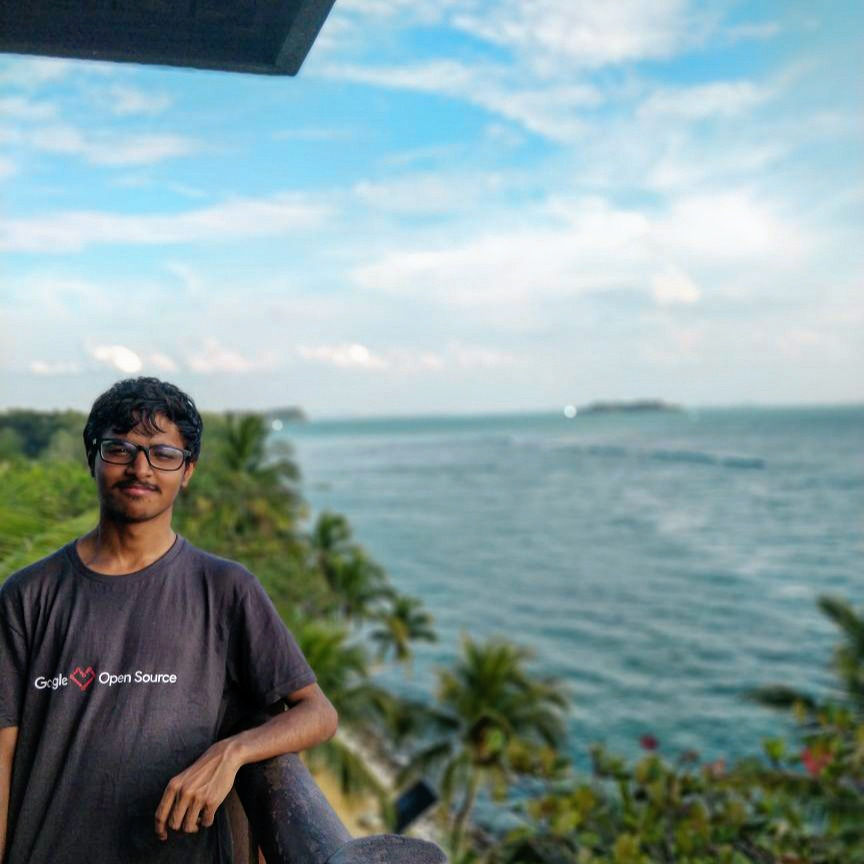

---
# You don't need to edit this file, it's empty on purpose.
# Edit theme's home layout instead if you wanna make some changes
# See: https://jekyllrb.com/docs/themes/#overriding-theme-defaults
layout: home
---

    

        
    

    

        
Hi, I'm Harshit and welcome to my blog!

        

            I'm currently a Software Engineer at <a
            href="https://grofers.com/">Grofers</a>, India's largest online grocery platform.
        

        

            Previously, I received my Bachelor's degree from <a
            href="http://lnmiit.ac.in/">LNM Institute of Information Technology (LNMIIT)</a>, and I had previous internship experience at <a
            href="https://www.hackerrank.com/products">HackerRank</a>, <a href="https://home.cern/">CERN</a> and <a href="https://fossasia.org/">FOSSASIA</a>. In this blog, I write about my interests in software engineering, travel, talks, photography and art.
        

    

